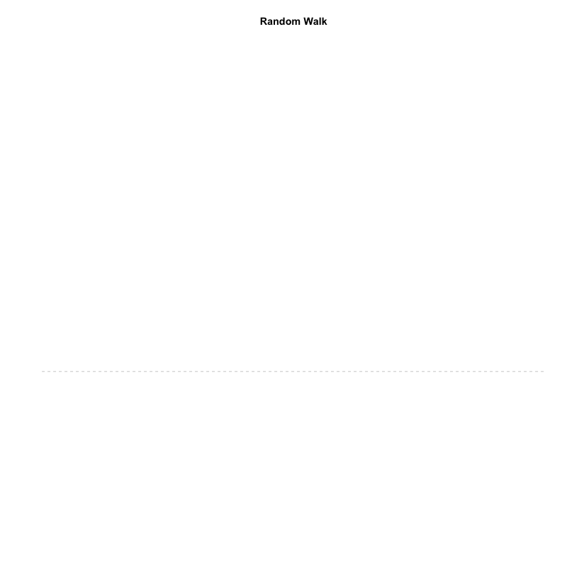

```{r setup, include=FALSE}
knitr::opts_chunk$set(echo = TRUE)
library(pander)
library(dplyr)
library(ggmap)
library(ggplot2)
library(animation)
```
#Animations!
```{r cars}
random.walk <- cumsum(rnorm(100))
  
plot( random.walk, type="l", col="darkred", axes=F, xlab="", ylab="", main="Random Walk" )
abline( h=0, lty=2, col="gray" )
```

```{r}
dir.create("gifs")
setwd("gifs")

#x <- cumsum( rnorm(100) )

random.walk <- cumsum(rnorm(100))
max.y <- max(random.walk)
min.y <- min(random.walk)


saveGIF({


for( i in 1:100 )
{
  plot( random.walk[1:i], pch=19, cex=2, xlim = c(0, 100), ylim = c(min.y, max.y), type="l", col="darkred", axes=F, xlab="", ylab="", main="Random Walk" )
abline( h=0, lty=2, col="gray" )
  
  }


}, 

movie.name = "movie_name.gif",   # name of your gif
interval = 0.1,                  # controls the animation speed
ani.width = 800,                 # size of the gif in pixels
ani.height = 800 )               # size of the git in pixels

```
